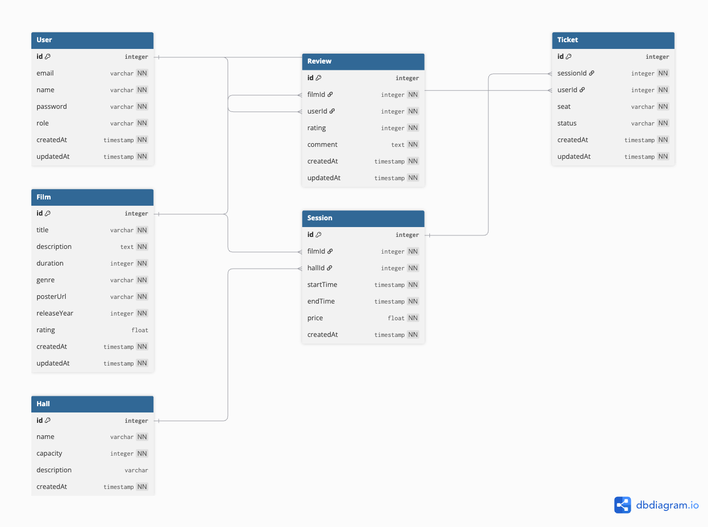

# BeerCinema — Система управления кинотеатром

**Автор:** Лисенко Алёна, M3308
**Репозиторий:** https://github.com/is-web-y27/m3308-lisenko-backend
**Деплой:** https://m3308-lisenko-backend-1.onrender.com

---

## Описание предметной области

BeerCinema — система управления кинотеатром, позволяющая вести каталог фильмов, управлять расписанием киносеансов, продавать и бронировать билеты, а также собирать отзывы зрителей.

Система поддерживает три роли пользователей: обычный клиент, менеджер и администратор. Клиенты могут просматривать фильмы и сеансы, бронировать и оплачивать билеты, оставлять отзывы. Менеджеры управляют фильмами и расписанием, администраторы — всем содержимым системы, включая пользователей.

---

## Технологии

- **Backend:** Node.js 22, TypeScript, NestJS 11
- **База данных:** PostgreSQL + Prisma ORM
- **Веб-интерфейс (MVC):** серверный рендеринг на Handlebars
- **REST API:** документация Swagger (OpenAPI 3.0) на `/api/docs`
- **GraphQL:** Apollo Server (code-first), playground на `/graphql`, ограничение глубины запросов
- **Авторизация:** сессии (express-session), пароли хешируются bcrypt, разграничение прав по ролям (guards)
- **Кэширование:** серверный кэш списка фильмов, ETag + Cache-Control
- **Файлы:** постеры фильмов в Yandex Object Storage (S3 API)
- **Хостинг:** Render.com

## Запуск

```bash
npm install
# .env: DATABASE_URL, SESSION_SECRET, YANDEX_ACCESS_KEY_ID, YANDEX_SECRET_ACCESS_KEY, YANDEX_BUCKET
npx prisma migrate deploy
npx prisma db seed
npm run start:dev   # http://localhost:3000
```

Тестовые пользователи из сида: `admin@beercinema.ru / admin123` (ADMIN), `client@example.com / client123` (CLIENT).

---

## Доменная модель

### Сущности

**User — Пользователь**
Клиент или сотрудник кинотеатра. Имеет роль (CLIENT / ADMIN / MANAGER), может покупать билеты и писать отзывы.

**Film — Фильм**
Фильм в прокате. Хранит название, описание, жанр, длительность в минутах, год выпуска, URL постера и средний рейтинг.

**Hall — Кинозал**
Физический зал кинотеатра с уникальным названием (например: «ЗОЖ», «Балтика», «Разливное пиво») и вместимостью.

**Session — Киносеанс**
Конкретный показ фильма в определённом зале в определённое время. Связывает Film и Hall, содержит цену билета.

**Ticket — Билет**
Бронирование или покупка конкретного места (например, «A1») на сеанс. Привязан к пользователю и сеансу. Статусы: RESERVED, PAID, CANCELLED. Одно место не может быть забронировано дважды на один сеанс.

**Review — Отзыв**
Отзыв пользователя о фильме: оценка от 1 до 5 и текстовый комментарий.

### Связи между сущностями

- `User` → `Ticket` (один ко многим): пользователь может купить много билетов
- `User` → `Review` (один ко многим): пользователь может оставить много отзывов
- `Film` → `Session` (один ко многим): фильм может идти на многих сеансах
- `Film` → `Review` (один ко многим): у фильма много отзывов
- `Hall` → `Session` (один ко многим): в зале проходит много сеансов
- `Session` → `Ticket` (один ко многим): на сеанс продаётся много билетов

### ER-диаграмма



---

## Авторизация в веб-интерфейсе

| Маршруты | Доступ |
|----------|--------|
| Просмотр фильмов, сеансов, страниц | все посетители |
| `/login`, `/register` | вход и регистрация (новые пользователи получают роль CLIENT) |
| Создание/редактирование/удаление фильмов и сеансов | MANAGER, ADMIN |
| Раздел `/users` | только ADMIN |
| Билеты и отзывы (создание/изменение) | любой вошедший пользователь |

REST и GraphQL API открыты для демонстрации (Swagger, playground).

---

## API Endpoints

Полная документация — Swagger на `/api/docs`. Все списки поддерживают пагинацию `?page=&limit=` и возвращают заголовок `Link` (RFC 5988).

### Films
| Метод | URL | Описание |
|-------|-----|----------|
| GET | `/api/films` | Список фильмов (пагинация, ETag, кэш) |
| GET | `/api/films/:id` | Фильм по ID |
| GET | `/api/films/:id/sessions` | Сеансы фильма |
| GET | `/api/films/:id/reviews` | Отзывы о фильме |
| POST | `/api/films` | Создать фильм |
| POST | `/api/films/:id/poster` | Загрузить постер (multipart, до 5 МБ) |
| PATCH | `/api/films/:id` | Обновить фильм |
| DELETE | `/api/films/:id` | Удалить фильм |

### Sessions
| Метод | URL | Описание |
|-------|-----|----------|
| GET | `/api/sessions` | Список сеансов |
| GET | `/api/sessions/:id` | Сеанс по ID |
| GET | `/api/sessions/:id/tickets` | Билеты сеанса |
| POST | `/api/sessions` | Создать сеанс |
| PATCH | `/api/sessions/:id` | Обновить сеанс |
| DELETE | `/api/sessions/:id` | Удалить сеанс |

### Users
| Метод | URL | Описание |
|-------|-----|----------|
| GET | `/api/users` | Список пользователей |
| GET | `/api/users/:id` | Пользователь по ID |
| GET | `/api/users/:id/tickets` | Билеты пользователя |
| GET | `/api/users/:id/reviews` | Отзывы пользователя |
| POST | `/api/users` | Создать пользователя |
| PATCH | `/api/users/:id` | Обновить пользователя |
| DELETE | `/api/users/:id` | Удалить пользователя |

### Tickets
| Метод | URL | Описание |
|-------|-----|----------|
| GET | `/api/tickets` | Список билетов |
| GET | `/api/tickets/:id` | Билет по ID |
| POST | `/api/tickets` | Создать билет |
| PATCH | `/api/tickets/:id` | Обновить билет |
| DELETE | `/api/tickets/:id` | Удалить билет |

### Reviews
| Метод | URL | Описание |
|-------|-----|----------|
| GET | `/api/reviews` | Список отзывов |
| GET | `/api/reviews/:id` | Отзыв по ID |
| POST | `/api/reviews` | Создать отзыв |
| PATCH | `/api/reviews/:id` | Обновить отзыв |
| DELETE | `/api/reviews/:id` | Удалить отзыв |

### GraphQL

Эндпоинт `/graphql`: запросы `films/sessions/tickets/users/reviews` (с пагинацией) и мутации `create*/update*/remove*`, а также семантические `reserveTicket`, `payTicket`, `cancelTicket`. Примеры — в [docs/GRAPHQL-CHEATSHEET.md](docs/GRAPHQL-CHEATSHEET.md).

---
